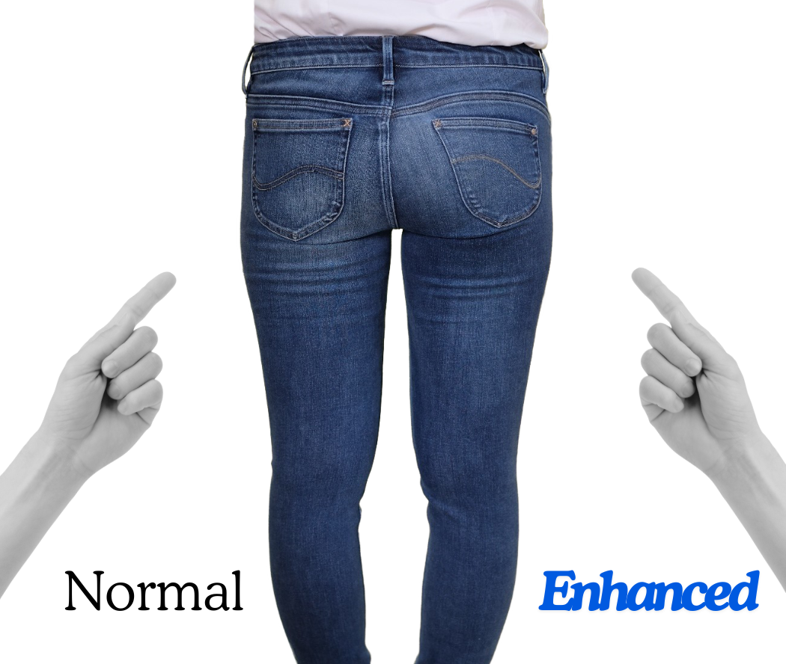
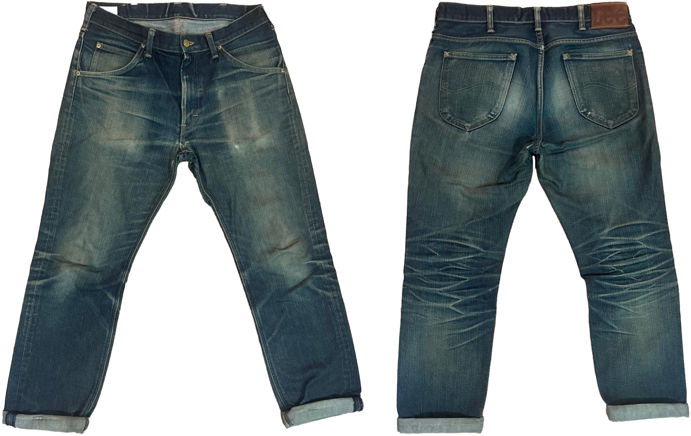
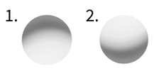
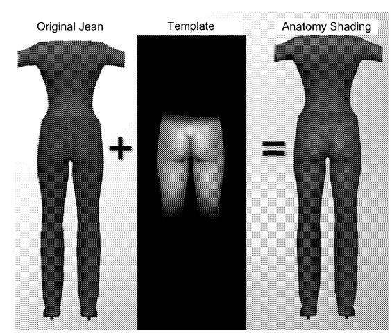
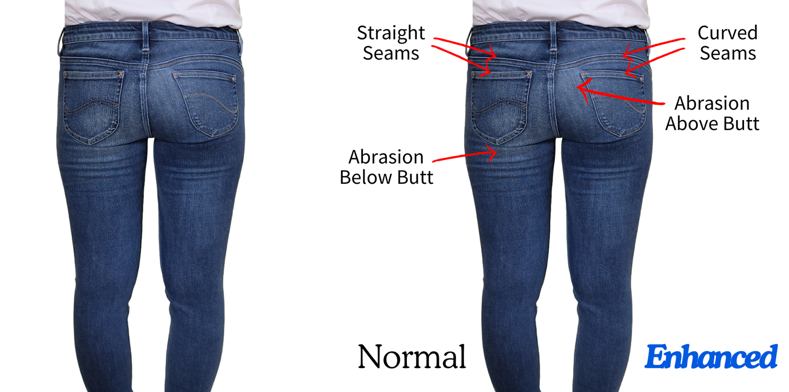
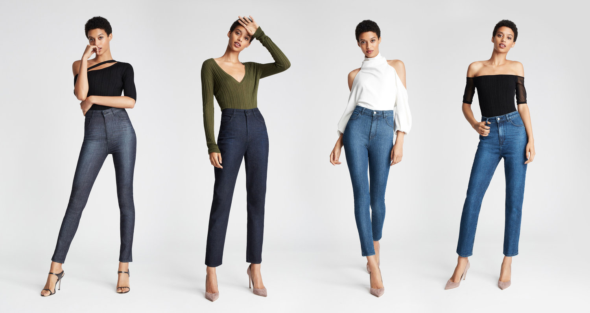
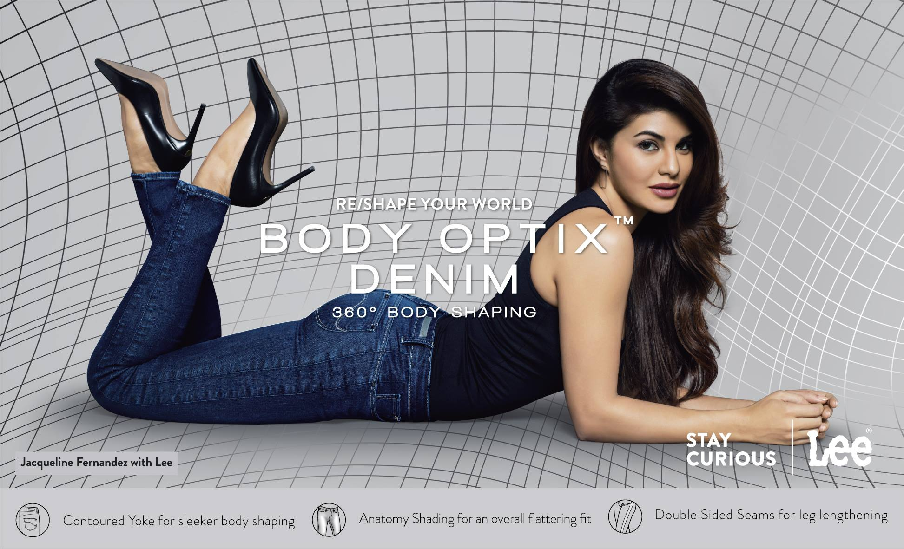

In 2014 I fell into a job where a primary responsibility was to make butts look good in jeans. 

To see what I mean by this, look at following photo. This is a single pair of jeans constructed differently on one side vs. the other.

On the left is standard construction for jeans &mdash; straight seams and abrasion applied just below the butt to make the jeans look "worn in" (more on this later). 

On the right is the construction I helped design while working for Lee Jeans. It has curved seams and abrasion applied just above the butt.

Again, *this is a single pair of jeans, worn by a single person.* Notice a difference? If you're like the customers we asked, you probably notice that her butt looks more pronounced &mdash; "perkier", "lifted", "enhanced" &mdash; on the right.

But, how? 

It's pretty simple really &mdash; it just took some nerds who studied vision science to think about it through the lens of their training. But, before we get into that, let's back up for a minute and talk about how jeans are normally made.

## About denim: Making new jeans look old

Jeans are unique in fashion because their indigo dyes fade as the garments are worn. The color fades all over, but there are certain high-wear areas where the indigo vanishes completely, showing the white yarn underneath. This "wear pattern" is responsible for the look of classic vintage denim.

People like jeans that look worn-in. The caveat is that one must wear the jeans for a while to get this look and not everyone has the patience. Thus, denim is often pre-distressed before it's sold.

Manufacturers fade the overall color with a number of washing techniques &mdash; enzymes, stones, and bleach to name a few. But, to get the wear pattern, they rub sandpaper on the jeans or use lasers to burn away the indigo. This is called "applying abrasion" to the denim.

Here's a video from Levi's that explains the process:

@[youtube](SMDlbNpE6dU | Levi's explains techniques for applying abrasion to denim.)

## Making butts look flat or perky with abrasion

In 2014, I was a graduate student in Psychology and one of the post-docs in our lab, [Darren Peshek](https://www.linkedin.com/in/darren-peshek), was sponsored by VF Corporation. He was working for their denim brands (at the time: Lee Jeans, Wrangler Jeans, and 7 for All Mankind). 

Darren's idea &mdash; as a student of visual perception &mdash; was that the standard method of applying abrasion to jeans may not be flattering, visually.

Consider how a pair of jeans wears-in on the backside. Jeans naturally wear just under the butt because that's where they make contact with chairs and such when we sit down. Thus manufacturers apply abrasion just below the butt. That is, they make the jeans lighter just below the butt.

Darren saw this as a shading gradient on the garment &mdash; darker above the butt and lighter below the butt &mdash; and knew that gradients like this give visual cues to shape. What visual effect might this have on a person's body?

Let's see for ourselves. Look at circle 1 below. What do you see?

For most people the gradient on circle 1 makes it look like an indentation or a hole, going into the page. So, if the gradient on your jeans is dark above your butt and light below (like circle 1), then it's giving a visual cue that your butt is concave, countering any shape your butt may have &mdash; it makes your butt look flat!

But, what if I turn the gradient upside-down so it goes from light on top to dark on the bottom (like circle 2)?

Now, my perception has flipped &mdash; circle 2 looks like a bump, coming out of the page.[^1]

So, if we flip the gradient &mdash; light on top, dark below &mdash; then it will give a visual cue that your butt is convex, in line with your actual butt shape &mdash; it makes your butt look like it pops out!

## Visual cues from human anatomy

Now, when we designed the "butt-enhancing" jeans, we didn't use simple gradients. We took it a step further. We made 3D avatars with different butt shapes. We then had people rate the butts for attractiveness. 

If I light a butt from above it will have a natural shading gradient, so we used the shading gradients from the most attractive butts as a guide to create abrasion on jeans. We called this *Anatomy Shading* because it was based on the anatomy of a 3D avatar.[^2]

We did the same thing for seams and pockets and called it *Anatomy Warping.*[^3]  

That is, we digitized a pair of regular jeans (with straight seams) and put them on our avatars with attractive butts in a 3D program. The avatar butts warped the seams around their 3D shape, much like a sphere warps straight lines to match its 3D shape.

 Straight lines vs. (2) straight lines warped around the surface of a sphere. Notice the impression of 3D shape you get from curving the straight lines.")

We reasoned that if we curved the seams and pockets to match the way they were warped by the avatars' butts, it would give the impression of a shapely rear-end.

.")

You can see the results of the combined effect of Anatomy Shading and Anatomy Warping in the original picture:

## Lee Body Optix

These findings made their way into a product line for Lee Jeans known as *Body Optix*. I spent a lot of time in factories with designers from Lee[^4] and scientist colleagues[^5] making this product line a reality.

The first season of Body Optix was Fall-Winter 2016 and it was only available in China and Hong Kong. Then, it became available in India, then in Europe, and eventually in the US via a collaboration with [Carly Cushnie](https://www.carlycushnie.com/). As the seasons went on, it expanded beyond jeans to shorts, shirts, jackets and dresses with the basic premise of contouring using principles from vision science.

Here is a smattering of some of the press and marketing material that built up around Body Optix: 

@[youtube](09F8IVLmcVg) "Original marketing video for Body Optix in China & HK (Fall-Winter, 2016)."

---

@[youtube](jGhra8Qjb-0) "Body Optix collaboration with Carly Cushnie in the US (Fall, 2018)."

---

---

---

[^1]: Our brains make assumptions about the world in order to resolve the ambiguous information they receives from our eyes. One such assumption is that, in general, light comes from overhead. This explains why circle 1 looks like a hole whereas circle 2 looks like a bump. If you're interested in learning more about the "rules of vision," see Don Hoffman's book [Visual Intelligence](https://archive.org/details/visualintelligen00dona) for an easy-to-follow but thorough introduction (Don was my graduate advisor).

[^2]: Hoffman, D.D., Peshek, D., Dull, S.F., Zades, S.H., & Fisher, R.O. (2022). Anatomy shading for garments (U.S. Patent № 11,344,071 B2). https://patents.google.com/patent/US11344071B2/

[^3]: Peshek, D.J., Mark, J.T., Marion, M., Stephens, K., Hoffman, D., & Zades, S.H. (2021). Body-enhancing garment and garment construction (U.S. Patent № 11,129,422 B2). https://patents.google.com/patent/US11129422B2/

[^4]: Shout out to [David Tring](https://www.linkedin.com/in/david-tring/?originalSubdomain=hk), [Jenny Chan](https://www.linkedin.com/in/jenny-chan-58521b26/), and [Varun Wadhawan](https://www.linkedin.com/in/varun-wadhawan-50831511/).

[^5]: Shout out to [Justin Mark](https://www.linkedin.com/in/justin-mark-phd/).