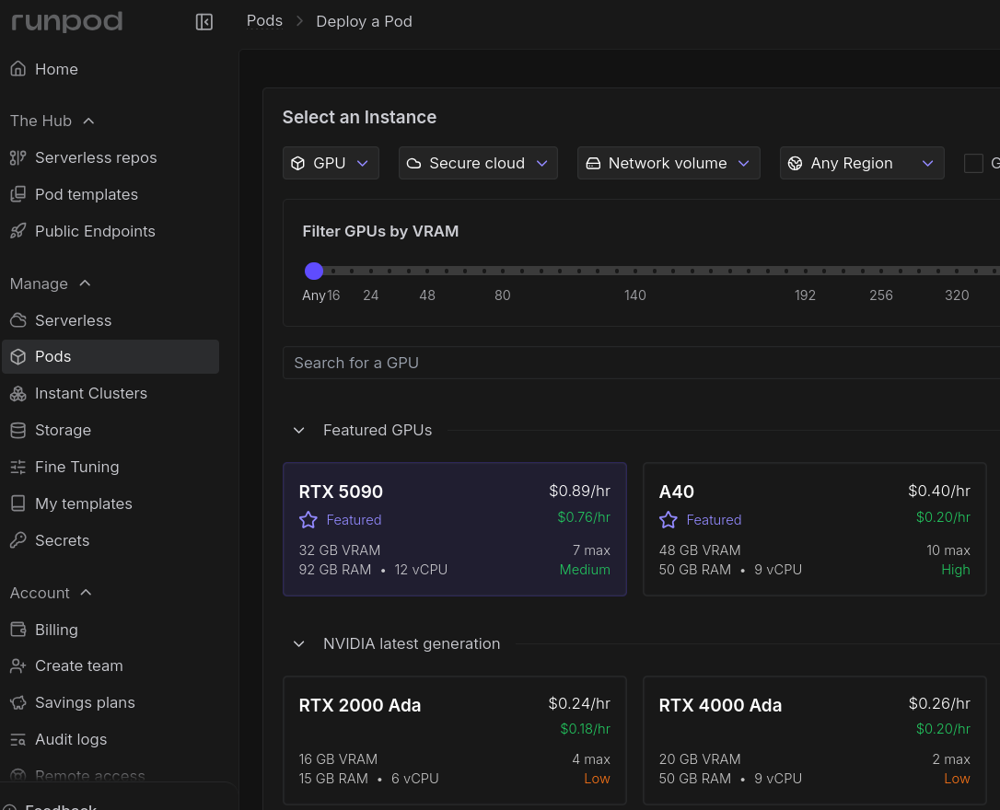
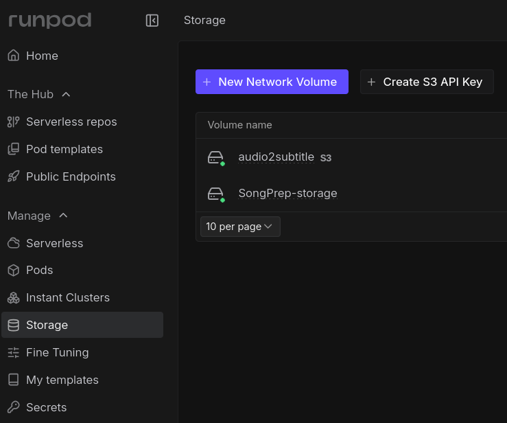
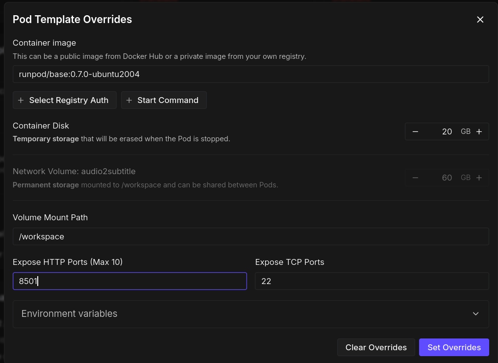
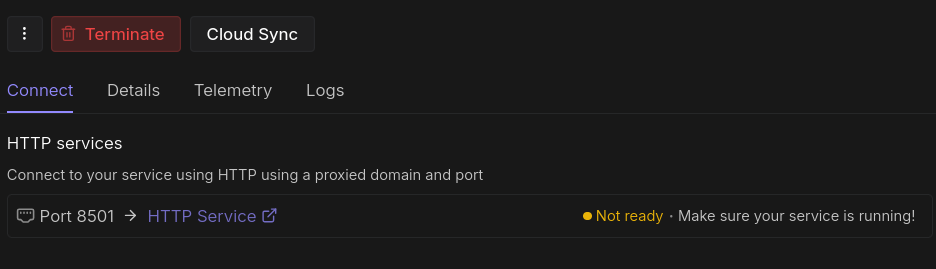
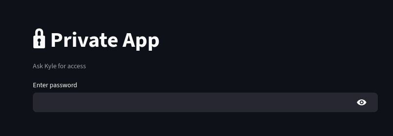

Sometimes &mdash; often as of late &mdash; I need to test machine-learning models that require compute resources beyond what my meager laptop can handle. This necessesitates a cloud server with computational resources (i.e., GPUs). My go-to service is [RunPod](https://www.runpod.io/). However, no matter how many times I use it, I always encounter some "gotcha" that makes my work take longer than it should. Each time this happens, I think, "ah crap, I should write that down." And then I promptly ignore myself and write nothing. Well, not this time. These are my notes for setting up RunPod. 

## Pro Tip : Start with Storage

### The perils of Pods

When I first started using RunPod, I would immediately go to the "Pods" page (it is called "RunPod" after all...), find a GPU powerful enough to complete my task, and then deploy it. Here's what the Pods page looks like as of this writing: 



There are two problems with this approach: 
1. **Pods are expensive.** For the kinds of tasks I'm running, I need at least 24GB of VRAM, which requires a GPU that costs around $.40/hr. If I just left this running, that would be $9.60/day, or $67.20/week. It adds up quick. 
2. **Pods can be stolen.** Runpod has an option to "stop" a running pod. This seems reasonable because I'm just testing a model and I'm not a maniac that wants to pay $67.20/week to keep the pod live. **HOWEVER**, once I stop the pod, the GPU becomes free for someone else to use. So, when I try to restart the pod, I may find &mdash; and, if my experience is representative, almost always will find &mdash; that there are 
["Zero GPU Pods"](https://docs.runpod.io/references/troubleshooting/zero-gpus) available. I just spent maybe an hour getting my environment all set up on the pod and now I can't even access the GPU. 

### The necessity of Network Volumes

A better approach is to first go to the "Storage" page: 



From here, click "New Network Volume", and make sure to set it up in a region that has the availability for the GPU you are looking for (typically, I will keep the "Pods" page open in a separate tab to see the GPU specs and pricing). Then, attach your network volume to a pod and set up your environment in `/workspace`. 

> [!info]+ Use `/workspace`
> The `/workspace` folder persists on the volume, so make sure to set up your code and environments there. 

#### Why is this better? 

1. **Network Volumes are cheap.** I currently have two network volumes for a couple of projects I'm running. Each one has 50GB of storage and costs only $3.50/month. 
2. **Network Volumes are versatile.** Once I have my environment set up in `/workspace`, I can safely terminate any pod connected to the Network Volume, knowing that the environment will persist on the Network Volume. Then, when I'm ready to run more tests, I can simply attach the Volume to another Pod.

> [!info]+ How to connect a Pod
> Once the Network Volume is created, connect a pod from the Storage page (NOT the Pods page) &mdash; click on the Volume, then click on the button "Configure Pod with Volume"

## Regarding Streamlit and Exposed HTTP Ports

For work, I often make backend APIs (typically with [FastAPI](https://fastapi.tiangolo.com/)) for clients to send and retreive information to use on their frontend. 

However, sometimes I need to demo a tool first, so a client can gauge the functionality and decide if it's something they want to incorporate. To make demos, I like to use [Streamlit](https://streamlit.io/) because it's easy and the UI looks nice. 

If you make an app with Streamlit, you can deploy it for free using [Streamlit Community Cloud](https://streamlit.io/cloud), but if your demo requires more than basic computing resources &mdash; e.g., if you need a GPU &mdash; than this won't work. 

In this case, you can share the app using RunPod with an exposed HTTP port. 

### Exposing HTTP ports in RunPod

When you click to add a pod to your network volume, click "edit" on the Pod template (under "Configure Deployment"). Then, on the pop-up modal ("Pod Template Overrides"), you have the option to Expose HTTP Ports: 



The default port for Streamlit is 8501, so set this. Then, when you click on your deployed pod, the HTTP Service link is the one you can share once your Streamlit app is running: 



## Guide to setting up a streamlit app in RunPod

### Step 1: Make app "private" (optional)
To make a Streamlit app "private", simply add a password-protected login screen to the app. Here's example code: 
```python
# Towards the top of streamlit_app.py
#...
def check_password() -> bool:
    """Simple password gate using Streamlit secrets."""
    if "password_ok" not in st.session_state:
        st.session_state.password_ok = False

    if st.session_state.password_ok:
        return True

    st.title("🔒 Private App")
    st.caption("Ask Kyle for access")

    pw = st.text_input(
        "Enter password",
        type="password",
        key="password_input",
    )

    if pw:
        if hmac.compare_digest(pw, st.secrets["APP_PASSWORD"]):
            st.session_state.password_ok = True
            st.rerun()
        else:
            st.error("Incorrect password")

    return False


if not check_password():
    st.stop()
#...
```
Then, add a `secrets.toml` file to `.streamlit/` with a password you can share with your colleagues (*make sure to add this file to .gitignore*)
```python
#.streamlit/secrets.toml
APP_PASSWORD = "YourCustomPassword"
```
Here's what this looks like for the user: 



### Step 2: Add repo to Pod

Once you have your Network Volume connected to a Pod, you need to add the code you want to execute. I presume you are coding locally and pushing changes to a GitHub repository. 

#### Public GitHub repo

Simply clone the repository into `/workspace` on the Pod:
```shell
git clone git@github.com:YOUR_REPOSITORY`
```

#### Private GitHub repo 

In this case, you need to make the repo accessible first. The easiest way to do this is with a GitHub Deploy Key. Here's how: 

1. *Create an SSH key on the pod:*
```shell
ssh-keygen -t ed25519 -C "runpod-demo" 
```
When prompted, repeatedly hit `enter` to use the default behavior and not set a passphrase.

2. *View the public key and copy it:*
```shell
cat ~/.ssh/id_ed25519.pub
```
It looks something like this: 
```shell
ssh-ed25519 AAAAC3NzaC1lZDI1NTE5AAAAI... runpod-demo
```

3. *Add Deploy Key to GitHub:*

Go to GitHub &rarr; Security &rarr; Deploy keys and click "Add deploy key." 

Title it whatever you want (typically same title chosen for the key, above it was "runpod-demo"), then paste the entire contents of the key into the Key box. 

After the key is added, you should be able to clone the repository to the Pod (and pull changes)

### Step 3: Set up your pod

Once you have cloned the repo, you need to install dependencies. On Runpod, the default machine often comes with older versions of Ubuntu (e.g., 20.04) and Python (e.g., 3.8). So, the first step is to update Python. 

#### 1. Set Python version

On an older version of Ubuntu (e.g., 20.04), I'll install Python using deadsnakes PPA: 
```shell
apt-get update
apt-get install -y software-properties-common
add-apt-repository -y ppa:deadsnakes/ppa
apt-get update
apt-get install -y python3.11 python3.11-venv python3.11-distutils
```

If I'm on an newer version of Ubuntu (e.g., 22.04+), I can skip the first 3 lines. 

Note: This is assuming I want to work with Python 3.11. Just replace with the desired version. 

#### 2. Set up Python virtual environment

Then, I'll use my desired Python version to set up a virtual environment: 

```shell
python3.11 -m venv /workspace/venvName
source /workspace/venvName/bin/activate
python --version   # sanity check: should show 3.11.x
```

Obviously, set the venvName for the specific project.

#### 3. Install Python dependencies inside that virtual environment

```shell
pip install --upgrade pip wheel setuptools
cd /workspace/git-repo
pip install -r requirements.txt
```
`/git-repo` is the cloned git repository from before. 

#### 4. Install non-Python dependencies (optional)

I'm currently doing alot of work in music information retreival and I use [FFmpeg](https://www.ffmpeg.org/) for reading, writing, and converting audio files. Thus, I need to install this: 

```shell
sudo apt-get update && sudo apt-get install -y ffmpeg
```

### Step 4: Shell script to run Streamlit app

To run a Streamlit app locally, you just type something like this in your terminal:

```shell
streamlit run app/streamlit_app.py
``` 

However, when running a Streamlit app from RunPod, there are a few more flags you need to pass to make it work properly: 
```shell
streamlit run app/streamlit_app.py \

# Allows RunPod Proxy to access the app:
  --server.address 0.0.0.0 \  

# Explicitly set listening port to avoid potential mismatch: 
  --server.port 8501 \

# Tells Streamlit: "You are a server-only app, don't try to act like a desktop":
  --server.headless true \

# Disabling CORS avoids issues related to how RunPod serves the app (via reverse proxy):
  --server.enableCORS false \

# Disabling CSRF (XSRF) token checks avoids issues related to how RunPod serves the app:
  --server.enableXsrfProtection false
```
I recommend putting all of this into a shell script on `/workspace`, so you can just type `/workspace/start_streamlit.sh` to start the app from a terminal connected to the pod. 

#### Example shell script: 

```shell
#!/usr/bin/env bash
set -e                  # Imediately exit script in case of errors
source /workspace/venvName/bin/activate # Activate virtual env

cd /workspace/git-repo  # Repository with the code you want to run

streamlit run app/streamlit_app.py \
  --server.address 0.0.0.0 \
  --server.port 8501 \
  --server.headless true \
  --server.enableCORS false \
  --server.enableXsrfProtection false
```

Obviously, change `/venvName/` to the name of your virtual environment and `/git-repo` to the name of your repository. 

